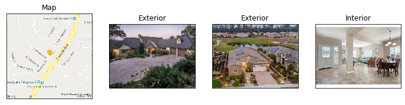
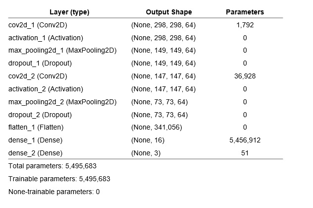
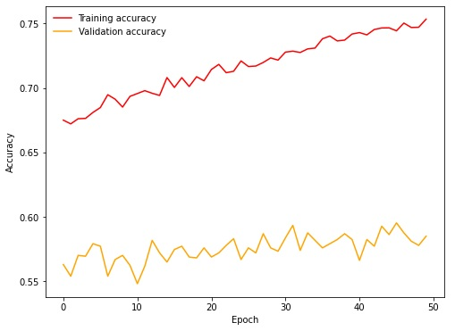
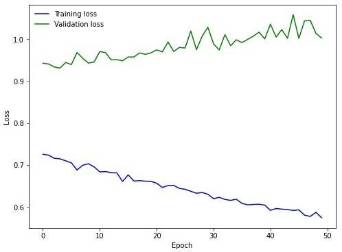

# Machine Learning Modeling and Prediction of Housing Prices (In Progress)

## Aim

The goal of this study is to accurately predict housing prices by comparing various machine learning models: linear, ridge, lasso, decision tree, random forest, gradient boosting regression, and convolutional neural network (CNN)-based classification.  This dataset includes relevant features and images of houses in Southern California.  It is available at: https://www.kaggle.com/ted8080/house-prices-and-images-socal.

## Methods
1. Exploratory data analysis

    Identify features in the dataset, plot distribution, and determine correlations.

2. Modeling

    Regression.  Supervised learning models were implented using Sckit-Learn.  The data was split into 70% training and 30% test set.  The predictor variables were standardized specifically for linear, ridge, and lasso models.  Grid search with k-fold cross validation was performed to find the optimal hyperparameters.  MAE: mean absolute error; MSE: mean standard error; RMSE: root mean standard error.

    Classification.  A 2-D CNN model was implented using Tensorflow-Keras.  The architectural design of the neural network was shown on Table.  The housing prices were grouped into three categories: high (1,000,000 and above), medium (500,000 to 999,999), and low (0 to 499,999).  Training, validation, and test data consist of 10,832, 1,547, and 3,095 images respectively.

3. Technologies

    Python, Numpy, Pandas, Matplotlib, Seaborn, Sckit-Learn, Tensorflow, Keras, AWS EC2.

## Exploratory Data Analysis

The dataset contains 15,474 housing entries and corresponding images.  A list of features in the dataset includes:
1. Image ID
2. Street
3. City
4. City code
5. Bed
6. Bath
7. Square foot
8. Price

Figure 1.  Histograms of the housing dataset.

Figure 2  Scatter plots of the housing dataset.

Figure 3.  Correlation matrix of the housing dataset.

## Regression Models

Hyperparameter optimization:

Random forest: best parameters: {'max_depth': 55, 'max_features': 'auto', 'min_samples_leaf': 1, 'n_estimators': 1550, 'oob_score': True}

Decision tree: best parameters: {'max_depth': 15, 'max_features': 'auto'}

Gradient boosting regression: best parameters: {'learning_rate': 0.01, 'max_depth': 10, 'max_features': 'auto', 'n_estimators': 4250, 'subsample': 0.15}

Ridge regression: best parameters: {'alpha': 0.0}

Lasso regression: best parameters: {'alpha': 0.001}

Figure 4.  Residual plots of the models.

Figure 5.  Gradient boosting regression: training set: RMSE vs learing rate at specific estimators.

Figure 6.  Gradient boosting regression: test set: RMSE vs learing rate at specific estimators.

Figure 7.  Gradient boosting regression: permutation importances of the training set.

Table 1.  Overall training and test results.

## Classification Model

Model selection: 2-D CNN

Predict class: high, medium, low price

Figure 8.  Housing Images.

Table 2.  CNN architecture.

Learning rate = 0.000001, optimizer = adam, epoch = 100 total

Figure 9.  Graph of accuracy (last 50 epochs).

Figure 10.  Graph of loss function (last 50 epochs).

Test accuracy = 0.5861, Precision = 0.5305, Recall = 0.6046

## Summary

This study performed several machine learning models to predict housing prices for regression and classification.  Gradient boosting regression outperforms all other models with the highest R2.