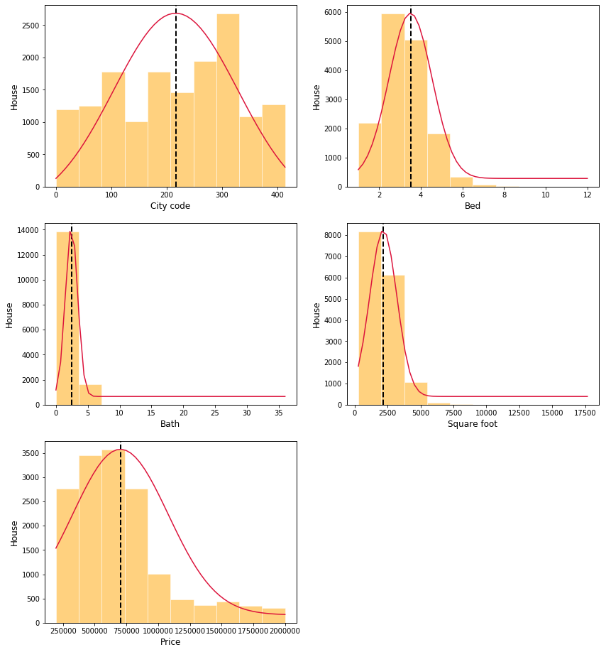
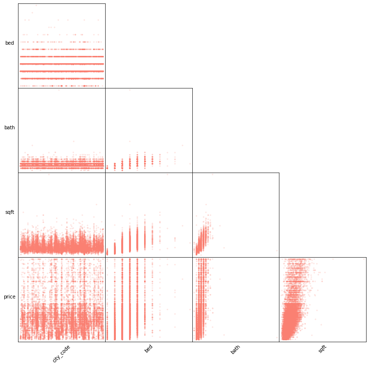
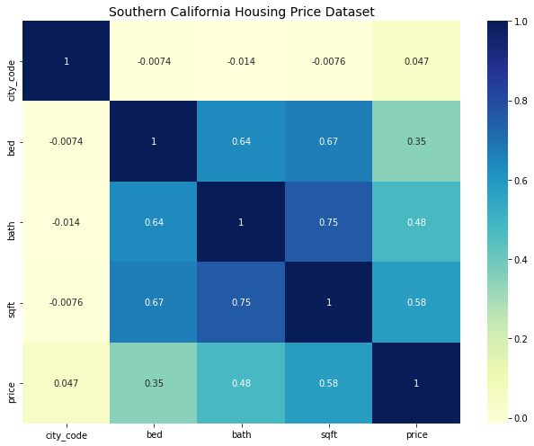
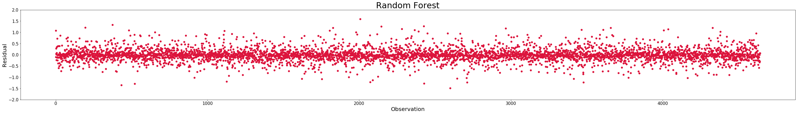
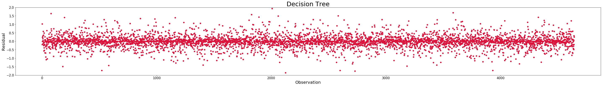
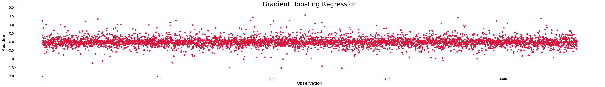
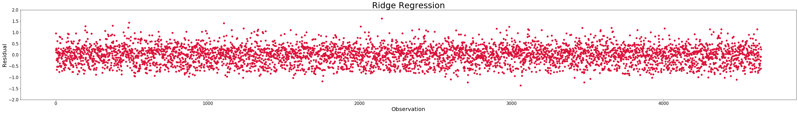
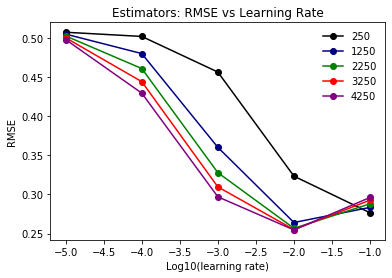
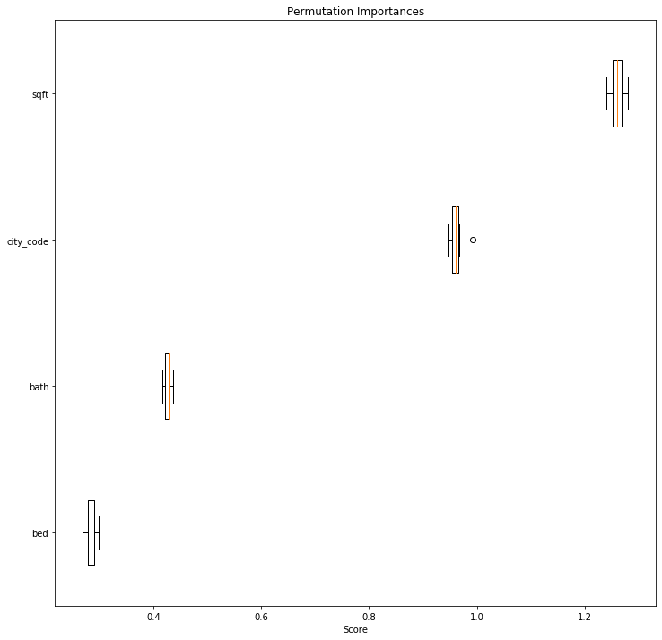
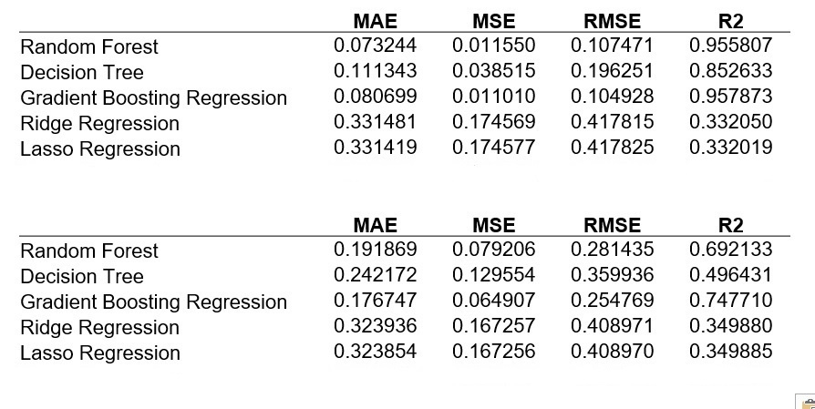

# Machine Learning Modeling and Prediction of Housing Prices (In Progress)

## Aim

The goal of this study is to accurately predict housing prices by comparing various machine learning models: linear, ridge, lasso, decision tree, random forest, gradient boosting, and convolutional neural network (CNN)-based regression and classification.  This dataset includes relevant features and images of houses in Southern California (https://www.kaggle.com/ted8080/house-prices-and-images-socal).

## Exploratory Data Analysis

Figure.  Histograms.

Figure.  Scatter plots.

Figure.  Correlation matrix.

## Results

Figure.  Residual plots.

Figure.  Gradient boosting regression: training set: RMSE vs learing rate at specific estimators.

Figure.  Gradient boosting regression: test set: RMSE vs learing rate at specific estimators.

Figure.  Gradient boosting regression: permutation importances of training set.

Table.  Overall training and test results.

